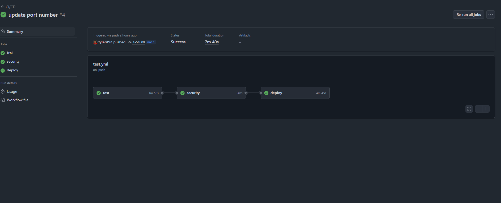

## Module 13 Assignment

### [Docker Hub Link](https://hub.docker.com/repository/docker/tdeans/module13/general)

## Running the Application
### Prerequisites
- Python 3.10
- Playwright installed: `pip install playwright`
- Playwright browsers installed: `python3 -m playwright install`

Create a virtual environment:
```bash
python3 -m venv venv
source venv/bin/activate
```

Download the requirements:
```bash
pip install -r requirements.txt
```

Run docker compose:
```bash
docker compose up --build
```

Go to `http://localhost:8000` in your browser.

Login


Registration


## Testing Commands

### Unit and Integration Tests
```bash
pytest # to run all tests
pytest -s -v # for more verbose output
pytest --preserve-db # to preserve the database between tests
pytest --run-slow # to run slow tests
pytest tests/integration # to run integration tests
```

### End-to-End Tests with Playwright
```bash
# Run E2E tests using the convenience script
./run_e2e_tests.sh

# Or run manually (make sure server is running on port 8000)
HEADLESS=true python3 -m pytest tests/e2e/test_playwright_simple.py -v

# Run in non-headless mode (visible browser) for debugging
HEADLESS=false python3 -m pytest tests/e2e/test_playwright_simple.py -v
```

### E2E Test Features
The Playwright end-to-end tests cover:
- Homepage loading and navigation
- User registration and login flows
- Authentication requirements
- Dashboard access and functionality
- Form validation and error handling
- Responsive design on different screen sizes
- Complete user journey workflows

Playwright Tests


GitHub Action Workflow


